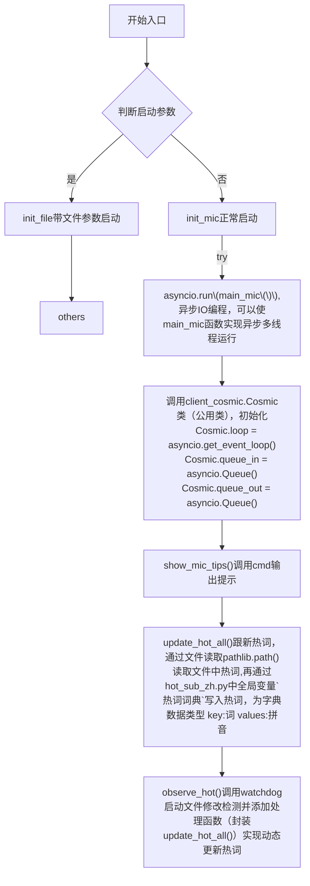

# CapsWriter_fixed
基于CapsWriter-Offline-master的语音识别器

## 1.流程图
### core_client.py

    # 打开音频流
    Cosmic.stream = stream_open()

    # Ctrl-C 关闭音频流，触发自动重启
    signal.signal(signal.SIGINT, stream_close)

    # 绑定按键
    bond_shortcut()

    # 清空物理内存工作集
    if system() == 'Windows':
        empty_current_working_set()
